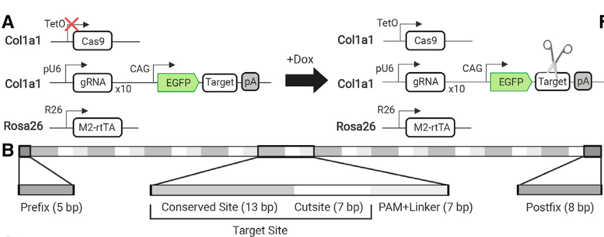

```{r setup, include=FALSE}
knitr::opts_chunk$set(echo = TRUE)
```

CARLIN (CRISPR array repair lineage tracing) technology comes from this paper [DOI:10.1016/j.cell.2020.04.048]

# In Brief
CARLIN (CRISPR array repair lineage tracing) is a mouse model that allows for simultaneous analysis of lineage and transcriptomic information of single cells *in vivo*.  

```{r, fig.align='center', fig.cap='Guide RNAs (gRNAs), target sites, and inducible Cas9 components are contained within th Col1a1 locus. The expression of each of the 10 gRNAs is driven by a spearate U6 promoter (pU6).The CARLIN array sits in the 3'UTR of GFP and consists of 10 sites that perfectly match the gRNAs. The doxycycline (Dox) reverse tetracycline-controlled transactivator (rtTA) is contained within the Rosa26 locus.'}

```


