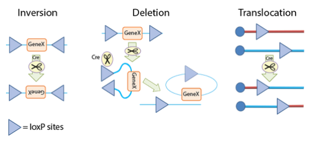

```{r setup, include=FALSE}
knitr::opts_chunk$set(echo = FALSE)
```

# Cre-Lox Technology
Cre-Lox Technology provides a sophisticated means to selectively express a given gene by creating knockouts, conditional knockouts, and reporter strains in a variety of organisms from plants to mice.  

LocP (**l**ocus of **X**(cross)-over in **P**1) sites are 34-base-pair long recognition sequences consisting of two 13-bp long palindromic repeats separated by an 8-bp long asymmetric core spacer sequence. The asymmetry in the core sequence gives the loxP site directionality, and the canonical loxP sequence is ATAACTTCGTATA-GCATACAT-TATACGAAGTTAT. All of the 34-bp are not necessary for successful recombination by Cre, some of the base pairs can be modified. The loxP sequence does not occur naturally in any known genome other than P1 phage, and is long enough that there is virtually no chance of it occurring randomly. Therefore, inserting loxP sites at deliberate locations in a DNA  sequence allows for very specific manipulations.  


|**loxP site**|**Left inverted repeat sequence**|**Spacer (5'->3')**|**Right inverted repeat sequence**|
|:--|:--|:--|:--|
|**Wild-type**|ATAACTTCGTATA|ATGTATGC|TATACGAAGTTAT|
|**lox 511**|ATAACTTCGTATA|ATGTATaC|TATACGAAGTTAT|
|**lox 5171**|ATAACTTCGTATA|ATGTgTaC|TATACGAAGTTAT|
|**lox 2272**|ATAACTTCGTATA|AaGTATcC|TATACGAAGTTAT|
|**m2**|ATAACTTCGTATA|AgaaAcca|TATACGAAGTTAT|
|**m3**|ATAACTTCGTATA|taaTAcca|TATACGAAGTTAT|
|**m7**|ATAACTTCGTATA|AgaTAgaa|TATACGAAGTTAT|
|**m11**|ATAACTTCGTATA|cgaTAcca|TATACGAAGTTAT|
|**lox 71**|taccgTTCGTATA|ATGTATGC|TATACGAAGTTAT|
|**lox 66**|ATAACTTCGTATA|ATGTATGC|TATACGAAcggta|

Cre recombinase, originally named because it "**c**auses **re**combination" (although later referred to as the "**c**yclization **re**combinase") is a 38 kDa protein responsible for intra- and inter-molecular recombination at loxP recognition sites. A key advantage of the system is that Cre acts independently of any other accessory proteins or co-factors, thus allowing for broad applications in a varity of experiments.  

The Cre-Lox system is a potent and specific system for controlling gene expression. The protein Cre recombinase recognizes 34 bp loxP sites, and the orientation and location of the loxP sites determines how the genetic materials will be rearranged. The schematic below shows the three types of rearrangements: inversion, deletion and translocation.  

- **Inversion**: If the loxP sites are on the same DNA strand and are in opposite orientations, recombination results in an inversion and region of DNA between the loxP sites is reversed.  
- **Deletion**: If the sites face in the same direction, the sequence between the loxP sites is excised as a circular piece of DNA (and is not maintained).  
- **Translocation**: If the sites are on separate DNA molecules, a translocation event is generated at the loxP sites.  

```{r, fig.align='center', fig.cap='Cre-lox mediated rearrangement.', fig.height=100}

```


# The usage of Cre-lox  
- **Cre-dependent gene expression** - placing a stop codon with loxP sites on either side (often called a 'lox-stop-lox' or 'LSL' cassette) upstream of a gene of interest will prevent gene expression in the absence of Cre. In the presence of Cre, the stop codon is excised, and gene expression proceeds. One popular lox-stop-lox plasmid is from Tyler Jack's lab: [Lox-Stop-Lox TOPO](http://www.addgene.org/11584/).  
- **Cre-dependent gene knockout** - conversely, putting the loxP sites on either side of a gene (called 'floxing' for '**f**lanked by **lox**P'), will permit gene expression until Cre is present, at which time the gene will be disrupted or deleted.  
- **Selection marker removal** - in conventional mouse targeting, targeted clones are selected for using a resistance marker; however, it is often desirable to remove the marker after the inital selection process. By floxing the selection marker, Cre can be used to easily perform this eviction.  
- **Regulated Cre expression** - placing Cre downstream of promoters that are active only in certain cell or tissue types, during certain stages of development, or by making the Cre inducible (such as with tamoxifen or doxycycline), the Cre recombinase can be expressed only in specified cells or at specified times. Combining this with some of the loxP methods described above, a genetic modification can be restricted based on experimental constraints. This has been used for a wide range of purposes, including activating an oncogene only in a particular organ, or bypassing embryonic lethality.  

To facilitate the use of Cre-lox technology, transgenic mice have been constructed that express Cre under a varity of ubiquitous and regulated promoters, and many loxP-containing alleles have also been constructed. Additionally, Cre-containing adenovirus (Ad-Cre) or AAV ([AAV-pgk-Cre](https://www.addgene.org/24593/)) has been used to successfully introduce Cre into cells of interest.  


# Two separate recombination events
One potential limitation of using loxP sites is the inability to tightly control which loxP sites recombine if more than two are present; intramolecular events happen with greater frequency than intermolecular events, but any two sites can potentially recombine. To account for this, alternate mutant versions of the loxP site have been created, which contain a unique asymmetric spacer "NNNTANNN", where "N" indicates which bases may vary from the canonical sequence. Among these are loxN (GtATACcT), lox2272 (GgATACtT), and lox511 (GtATACAT). These variant lox sites undergo recombination with other sites of the same type, but are not cross-compatible. Using different lox site variants allows Cre to catalyze more than one specific recombination event in a single system.  

The Saccharomyces cerevisiae FLP-FRT recombination system is another site-directed recombination technology very conceptually similar to Cre-lox, with flippase (Flp) and the short flippase recognition target (FRT) site being analogous to Cre and loxP, respectively. The FLP-FRT technology can be an effective alternative to Cre-lox, and has also been used in conjunction with it, allowing for two separate recombination events to be controlled in parallel.  


# History
Historic papers
- Bacteriophage Pl Site-specific Recombination I. Recombination between loxP Sites. Nat Sternberg, Daniel Hamilton. (1981) - Discovery of the Cre-lox system in bacteriophage P1.   
- Functional expression of the cre-lox site-specific recombination system in the yeast Saccharomyces cerevisiae.- Sauer B. (1987) - first use of Cre recombinase in yeast.   
- Site-specific DNA recombination in mammalian cells by the Cre recombinase of bacteriophage P1- Sauer B, Henderson N (1988) - first use of Cre recombinase in mammalian cells.   
- Tissue-and site-specific DNA recombination in transgenic mice - Paul Orban, Daniel Chui, Jamey Marth (1992) - first use of Cre-loxP mouse.   


# useful resources  
https://uvmgg.fandom.com/wiki/Cre-lox_technology
https://blog.addgene.org/plasmids-101-cre-lox


