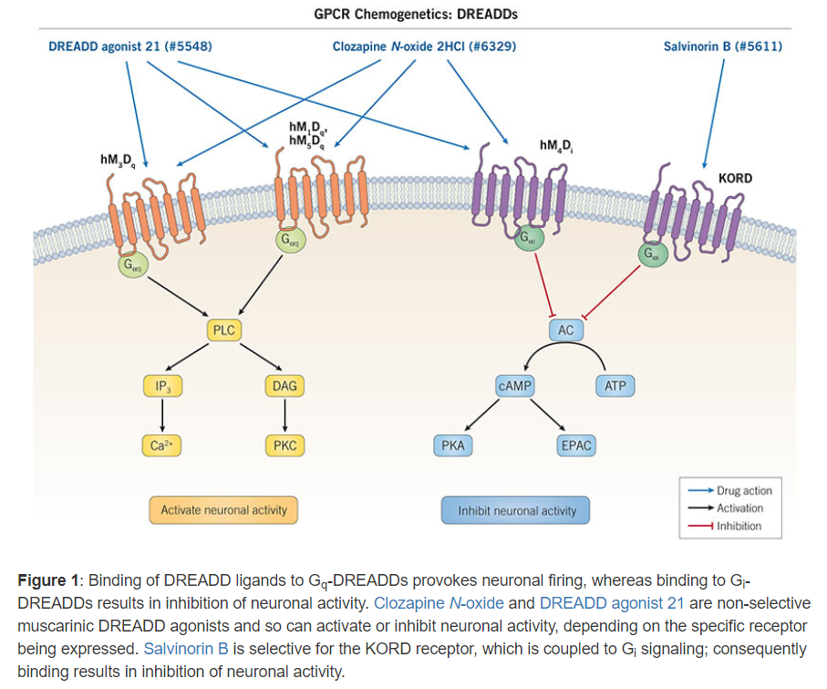

```{r setup, include=FALSE}
knitr::opts_chunk$set(echo = TRUE)
```


# DREADD Ligands
**DREADD** (**Designer Receptors Exclusively Activated by Designer Drugs**) are genetically modified G protein-coupled receptors (GPCRs) that activated by physiolohically inert designer synthetic ligands (designer drugs), known as DREADD ligands. They are a chemogenetic tool, commonly used to manipulate neuronal activity and to investigate GPCR signaling pathways.  

# DREADD Mechanism of Action  
The first DREADDs to be developed were derived from human muscarinic acetycholine receptors (mAChRs) and termed hM1-5. These receptors have mutations in their orthosteric binding site, abolishing affinity for the endogenous ligand ACh, while rendering them responsive to small molecule DREADD ligands, such as Chozapine-N-oxide (CNO) or Deschloroclozapine (DCZ).  

The effect of ligand binding depends on the G protein-coupling of the DREADD. Binding of a ligand to DREADDs coupled to Gq signaling pathway (hM~1~D~q~, hM~3~D~q~ and hM~5~D~q~) activates phospholipase C, which catalyzes the cleavage of phosphatidylinositol 4,5-bisphosphate (PIP~2~) to inositol 1,4,5-trisphosphate (IP~3~) and 1,2-diacylglycerol (DAG). Both IP~3~ and DAG have second messenger functions: IP~3~ binds to its intracellular receptors to elicit Ca^2+^ release from intracellular stores, while DAG activates multiple forms of protein kinase C (PKC). When activated by ligand binding, DREADDs coupled to the Gi signaling pathways cause inhibition of adenylyl cyclase (AC), leading to a decrease in intracellular cAMP levels. cAMP activates protein kinase A (PKA) and EPAC, therefore ligand binding at G~i~ DREADDs inhibits PKA and EPAC downstream signaling. G~i~-coupled DREADD are also known as inhibitory DREADDs (iDREADDs).  

Following the development of muscarinic DREADDs, another iDREADD has been developed from the κ-opioid receptor, termed KORD. KORD is activated by the pharmacologically inert small molecule Salvinorin B, and like hM4Di, is coupled to the Gi signaling pathway. The simultaneous use of KORD and hM3Dq with their associated DREADD ligands enables researchers to have bidirectional control over neuronal activity, and the simultaneous interrogation of κ-opioid and mAChR signaling.

```{r, fig.align='center'}

```

In addition to coupling to G proteins, GPCRs can also activate β-arrestin mediated signaling pathways. This non-canonical pathway can be controlled by CNO acting at a mutated M3 muscarinic receptor known as Rq(R165L), which activates arrestin signaling pathways without changes to G protein-mediated pathways.  

More recently a DREADD derived from the human free fatty acid receptor 2 (FFA2) has been developed. Baring mutations that alter the length of free fatty acid that acts at the receptor, FFA2-DREADD responds to Sorbic acid, but not short chain free fatty acids. Using FFA-DREADD knockin mice researchers have been able to investigate the role of FFA2 in the gut.  

CNO is a metabolite of Clozapine; research suggests that this metabolism is bidirectional, and that CNO may undergo reverse metabolism to clozapine in vivo in mice, rats, guinea pigs and non-human primates. Clozapine is an atypical antipsychotic that displays antagonism at dopamine receptors and 5-HT~2A/2C~ receptors, so its presence in in vivo investigations of neuronal pathways may confound experimental results. Additionally, CNO is a substrate for the P-glycoprotein (P-gp) multidrug transporter, which is expressed on the blood brain barrier where it helps maintain the integrity of the blood brain barrier, and prevents the entry of drugs and removes them from the CNS.  

The potential generation of clozapine and efflux of CNO from the brain has necessitated the development of DREADD ligand alternatives to CNO. DREADD agonist 21 is a potent hM3Dq and hM4Di DREADD agonist that displays excellent blood brain barrier penetration. Similarly, Deschloroclozapine is a high affinity and highly potent activator hM~3~D~q~ and hM~4~D~i~ DREADDs, which displays low 'off-target' binding to other GCPRs, ion channels and transporters. DCZ is particularly suited to in vivo use as it displays 100-fold greater affinity for hM~3~D~q~ and hM~4~D~i~ compared to CNO, and exhibits rapid (approximately 10 minutes after intraperitoneal injection) binding and activation of hM~3~D~q~ and hM~4~D~i~ in mice and non-human primates.  


# Activators  
|**Product Name**| **Activity**|
|:--|:--|
|Clozapine N-oxide|Activator of hM~3~D~q~ and hM~4~D~i~ DREADDs|
|Clozapine N-oxide dihydrochloride|Activator of hM~3~D~q~ and hM~4~D~i~, water soluble version of Clozapine N-oxide|
|Deschloroclozapine|High affinity and highly potent activator of hM~3~D~q~ and hM~4~D~i~ DREADDs, rapidly blood brain barrier penetrat.  
|DREADD agonist 21|Potent hM~3~D~q~ and hM~4~D~i~ DREADDs agonist; water soluble version of DREADD agonist 21|
|JHU 37152|High affinity and highly potent hM~3~D~q~ and hM~4~D~i~ DREADDs agonist; blood brain barrier penetrant|
|JHU 37160|High affinity and highly potent hM~3~D~q~ and hM~4~D~i~ DREADDs agonist; blood brain barrier penetrant|
|Olanzapine|Highly potent hM4Di activator; also 5-HT2A and D2 antagonist|
|Perlapine|Potent hM3Dq and hM4Di DREADD agonist in vitro|
|Salvinorin B|	Activator of κ-opioid DREADD (KORD)|
|Sorbic acid|Activator of hFFA2-DREADDs|


