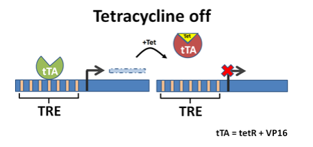
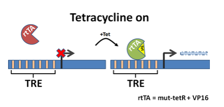

```{r setup, include=FALSE}
knitr::opts_chunk$set(echo = FALSE)
```

# Background  
To advance the study of gene function, scientists were in search of inducible promoters of controlling eukaryotic gene expression. Several endogenous promoters had been identified that responded to stimuli, such as hormones or metal ions; however, these systems were confounded by secondary effects. Scientists began to pursue a non-endogeous system for eukaryotes. At the time, bacterial systems from *E.coli* presented the best candidates for inducible expression.  

Bacterial systems were tested for functionality in mammalian cells. The lac system with the IPTG inducer was tested first, and IPTG was found to be inefficient, resulting in low levels of induction. In 1992, Manfred Gossen and Hermann tested the tet system in a mammalian system (Hela) and found that tet system was functional, and had rapid induction with efficient tettracyline uptake.  

# Tet System and the Tet Response Element (TRE)
- A TRE is a 7 repeats of a 19 nucleotide tetracyline operator (tetO) sequence, and is recognized by the tetracyline (tetR). In the endogenous bacterial system, if tetracycline, or one of its analogs like doxycycline, are present, tetR will bind to tetracycline and not to the TRE, permitting transcription.  

- Tetracycline-dependent promoters are developed by placing a TRE **<a style='color:red'>upstream </a>** of a minimal promoter.  

# Tetracycline Off System  
In the Tet-Off expression system, a tetracycline-controlled transactivator protein (tTA), which is composed of the Tet repressor DNA binding protein (TetR) from the Tc resistance operon of Escherichia coli transposon Tn10 fused to the strong transactivating domain of VP16 from Herpes simplex virus, regulates expression of a target gene that is under transcriptional control of a <a style='color:red'>tetracycline-responsive promoter element</a> **(TRE)**.  

The TRE is made up of Tet operator (tetO) sequence concatemers fused to a minimal promoter, (commonly the minimal promoter sequence derived from the human cytomegalovirus (hCMV) immediate-early promoter). In the absence of Tc or Dox, tTA binds to the TRE and activates transcription of the target gene. In the presence of Tc or Dox, tTA cannot bind to the TRE, and expression from the target gene remains inactive.  

```{r, fig.align='center'}

```


# Tetracycline On System  
The Tet-On system is based on a reverse tetracycline-controlled transactivator, rtTA. Like tTA, rtTA is a fusion protein comprised of the TetR repressor and the VP16 transactivation domain; however, a four amino acid change in the tetR DNA binding moiety alters rtTA's binding characteristics such that it can only recognize the tetO sequences in the TRE of the target transgene in the presence of the Dox effector. Thus, in the Tet-On system, transcription of the TRE-regulated target gene is stimulated by rtTA only in the presence of Dox.  

The two vector design of the Tet-Off and Tet On systems allows tissue-specific promoters to drive tTA or rtTA expression, resulting in tissue-specific expression of the TRE-regulated target transgene. Further, the ability to strictly regulate the level of rtTA and tTA activity allows the investigator to regulate activation of the target gene both quantitatively and temporally.  

```{r, fig.align='center'}

```

> Important note: expression of a TRE-regulated transgene may be influenced also by its chromosomal insertion site.  


# Experiment Tips
- Choosing a tet system
    + If your gene of interest should be active, and only turned off occasionally, using tetracycline off or tTA is more appropriate.  
    
    + If your gene of interest should be mostly inactive, and only turned on occasionally, using tetracycline on or rtTA is more appropriate.  


- Basic components  
    + Components for a tetracycline off system are:  
        + Plasmid containing a tetracycline-dependent promoter upstream of your gene of interest  
        + tTA expression plasmid  
        
    + Components for a tetracycline on system are:  
        + Plasmid containing a tetracycline-dependent promoter upstream of your gene of interest  
        + rtTA or TetR expression plasmid  
        
    + Stable cell line can be made that continuously express a system component.  


- Use of tetracycline or a derivate  
    + A derivate of tetracycline, doxycline (dox), is a prefered effector for tetracycline transregulation. Dox binds with high affinity to tTA and rtTA, thus dox can be used in both tetracycline on and off systems.  
    + Dox also has good tissue distribution, low toxicity, a known half-life (24 hours), and is compararably inexpensive.  
    + The induction profiles for other tetracycline derivatives can be viewed in Krueger et al, 2004.  
    + Some cell culture sera may contain tetracycline or its derivatives which can result in unintended system induction. Investigate whether or not your serum is tetracycline-free.  
    
# Explain  
- **TRE**: 7 repeats of a 19 nucleotide tetracycline operator (tetO)  
- **tetR**: tetracycline repressor, like tetracycline or doxycycline, binding to tetracycline operator (tetO).  
- **tTA** = tetR + VP16. tetracycline off, when tetracycline or its analogous present, tTA, an repressor, perferely binding to tetracycline rather than operator (tetO), thus results the increased expression of subsequent gene.  
- **rtTA** = mut-tetR + VP16. tetracycline on, when tetracycline or it's analogous present, rtTA, an activator, preferentially binding to the tetO, and activate the expression of subsequent gene.  


