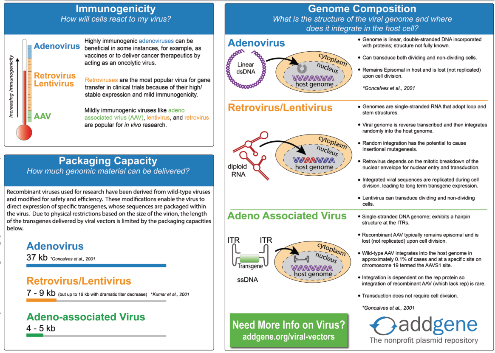
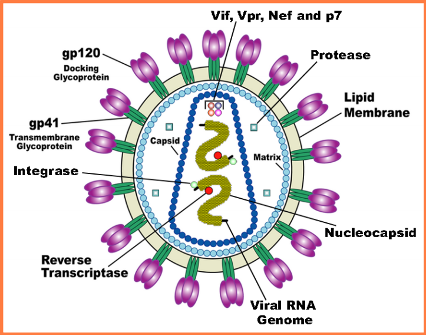
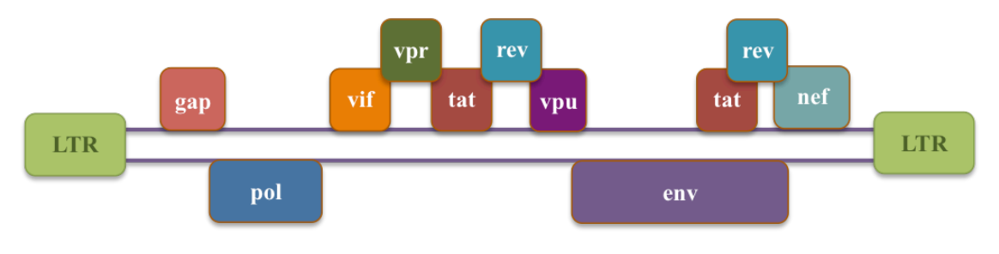
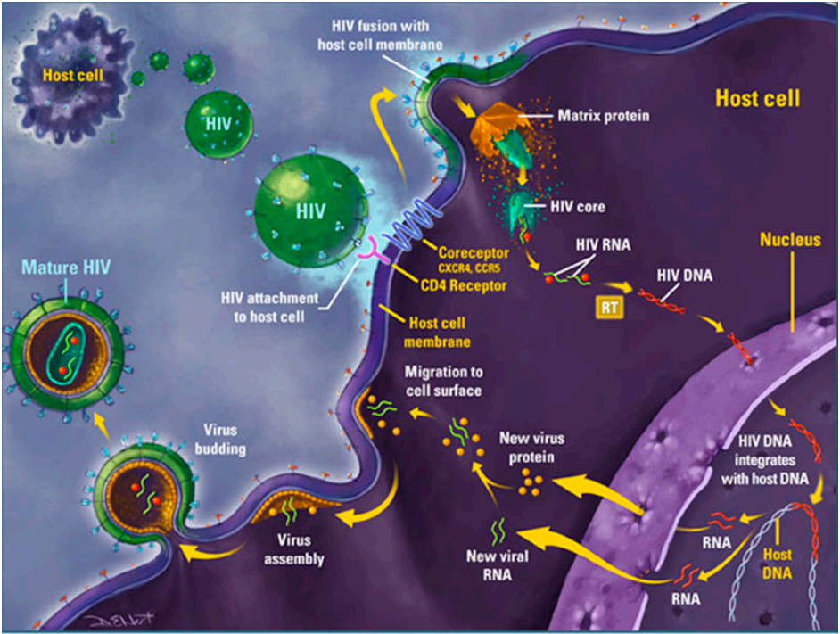

```{r setup, include=FALSE}
knitr::opts_chunk$set(echo = FALSE)
```


# Type of virus  
|**Type of viru**|**Pros**|**Cons**|
|:--|:--|:--|
|Retrovirus|- stable gene expression <br> - Broad tropism|- Only infects dividing cells <br> - Moderate immunogenicity <br> - Insertional mutagenesis possible|
|Lentivirus|- Infects non-dividing cells <br> - Broad tropism|- Insertional mutagenesis possible|
|Adenovirus|- Remains episomal (little risk of insertional mutagenesis) <br> - High gene expression <br> - Infects non-dividing cells <br> - Large packaging capacity <br> - High transduction efficiency <br> - Broad tropsim|- Transient gene expression <br> - High immunogenecity|
|AAV|- Remains episomal (little risk of insertional mutagenesis) <br> - Very low immunogenecity <br> - Infects non-dividing cells|- Transient gene expression <br> - Low tropsim for mouse cells and hemotopoietic cells <br> - Low packaging capacity (~ 4.5kb)|

---

```{r, fig.align='center'}

```

# AAV


# Lentivirus
## Basic information
- Family: Retroviridae
- Genus: Lentivirus
- Enveloped
- Size: ~ 80 - 120 nm in diameter
- Genome: Two copies of positive-sense ssRNA inside a conical capsid
- Risk Group: 2

## Lentivirus Characteristics
Lentivirus (lente-, latin for 'slow') is a group of retroviruses characterized for long incubation period. They are classified into five serogroups according to the vertebrate hosts they infect: bovine, equine, feline, ovin/caprine and prinate. Some examples of lentiviruses are Human (HIV), Simian (SIV) and Feline (FIV) Immunodeficiency Viruses.  

Lentiviruses can deliver large amounts of genetic information into the DNA of host cells and can integrate in both dividing and non-dividing cells. The viral genome is passed onto duaghter cells during division, making it one of the most efficient gene delivery vectors. Most lentiviral vectors are based on the HUman Immunodeficiency Virus (HIV).  

## Structure of the HIV Virus
The structure of HIV is different from that of other retroviruses. HIV is roughly spherical with a diameter of ~ 120 nm. HIV is composed of two copies of positive ssRNA that code for nine genes enclosed by a conical capsid containing 2000 copies of the p24 protein. The ssRNA is tighly bound to nucleocapsid proteins, p7, and enzymes needed for the development of the virion: reverse transcriptase (RT), proteases (PR), ribonuclease and integrase (IN). A matrix composed of p17 surrounds the capsid ensuring the integrity of the viron. This, in turn, is surrounded by an envelope composed of two layers of phospholipids taken from the membrane of a human cell when a newly formed virus particle buds from the cell. Embedded in the viral envelope are proteins from the host cell and about 70 copies of a complex HIV protein, known as Env, that protrudes through the surface of the virus particle. Env consists of a cap made of three gp120 molecules, and a stem consisting of three gp41 molecules that anchor the structure into the viral envolope. The glycoprotein complex enables the virus to attach to and fuse with target cells to initiate the infections cycle.

---

```{r, fig.align='center'}

```


## genome Organization of the HIV-1 Virus
The HIV-1 genome contains 9749 bp. In addition to the **gap**, **pol**, and **env** genes common to all retroviruses, HIV-1 contains:  
- Two regulatory genes - **tat** and **rev** - indispensable for virus replication
- Four accessory genes - **vif**, **vpr**, **vpu**, and **nef** - that, while dispensable for *in vitro* virus growth, are key for in vivo replication and pathogenesis.  

|**Category**|**Gene**|**Full Name**|**Precursor Proteins -> Products**|
|:--|:--|:--|:--|
|**Essential Genes** <br> **&** <br> **Regulatory Elements**|gag|Group-specific antigen|gag --> MA, CA, SP1, NC, SP2, P6|
||pol|Polymerase|pol --> RT, RNase H, IN, PR|
||env|Envelope|gp160 -> gp120, gp41|
||tat|HIV Transactivator|Positive regulator of transcription|
||rev|Regulator of expression of virion proteins|Important for synthesis of major viral proteins and essential for viral replication.|
|**Accessory Genes**|vif|Viral infectivity|required for infectivity in some cell types|
||vpr|Virus protein R|Nuclear import of pre-integration complex and host cell cycle arrest|
||vpu|Virus protein U|Proteasomal degradation of CD44 and release of virious from infected cells|
||nef|Negative factor|Role in apoptosis and key in increasing virus infectivity|

---

```{r, fig.align='center'}

```


## The life cycle of HIV Virus
The life cycle of HIV begins with viral entry, a multi-step interaction between the HIV envelope and the host target cell surface receptors. In the initial step of entry, the HIV gp120 protein binds to the host target cell CD4 receptor, thereby anchoring HIV to the host cell. This interaction generates a conformational change in the HIV envelope that stimulates HIV binding with a host cell co-receptor; the main co-receptors used by HIV are CCR5 and CXCR4. Subsequently, the viral and host membranes fuse, the viral capsid enters the cell, and the HIV core dissolves releasing the two copies of single-stranded HIV RNA. The next step, reverse transcription, involves the conversion of the HIV ssRNA to double-stranded DNA (dsDNA) by the HIV enzyme reverse transcriptase (RT). The RT uses the cellular nucleotides as the building blocks for synthesizing HIV DNA. Next, the HIV DNA complexed with other HIV proteins migrates inside the host nucleus. The HIV integrase (IN) enzyme then catalyzes the integration of the HIV DNA into the host DNA. Once the HIV DNA has integrated into the host genome, it is referred to as proviral DNA. The HIV provirus remains part of the host DNA and is perceived by the cell as normal host cellular DNA. The cellular enzymes transcribe the proviral DNA into messenger RNA (mRNA) and genomic RNA. The control of the transcription of proviral DNA involves multiple factors, including the HIV Tat protein and cellular modulators. The viral mRNA then is exported out of the nucleus into the host cell cytoplasm where cellular enzymes translate the viral mRNA into viral proteins. The larger viral proteins require cleaving into smaller, functional proteins, a step performed by the HIV enzyme protease (PR). The multiple components of the HIV are then assembled and, as the HIV buds off from the cell, further processing occurs to complete the viral life cycle, with the final product consisting of a mature HIV virion capable of infecting other cells.

```{r, fig.align='center'}

```

## Stages of HIV Infection  
1. Acute Infection
    + During this time, large amounts of the virus are being produced in your body.  
    + Many, but not all, people develop flu-like symptoms often described as the "worst-flu ever".  

2. Clinical Latency  
    + During this stage of the disease, HIV reproduces at very low levels, although it is still active.  
    + During this period, you may not have symptoms. With proper HIV treatment, people may live with clinical latency for several decades. Without treatment, this period lasts an average of 10 years, but some people may progress through this stage faster.  

3. ADIS
    + As your CD4 cells fall below 200 cells/mm^3^, you are considered to have progressed to ADIS.  
    + Without treatment, people typically survive 3 years.


The symptomes of **acute infection** are usually non-specific. Some individuals develop flu-like symptoms approximately two to four weeks after infection, while other are asymptomatic. During this period, HIV replicates rapidly destroying numerous CD4^+^ cells until reaching a viral *set point* - a relatively stable level of HIV virus in the body.  

During the **clinical latency** stage, the virus continues to reproduce at every low levels - reason why this stage is also known as "asymptomatic or chronic HIV infection".  

In a final stage, individuals progress from a chronic HIV infection to full-blown AIDS (Acquired Immunodeficiency Syndrome). **AIDS** patients are susceptible to a wide range of opportunistic infections and HIV-related cancers because their immune systems are seriously damaged. A CD^4+^ count lower than 200 cells/mm^3^ , or the development of one or more opportunistic infections, is indicative of AIDS in HIV^+^ individuals.  

## Cell Tropism of HIV and Pseudotyping  
HIV can infect a wide variety of human immune cells like CD4+ T-cells, macrophages and microglial cells. Viral entry into target cells occurs through interaction between HIV’s gp120 and the CD4 molecules and chemokine co-receptors (CCR5 or CXCR4) present in the surface of the
host cells. Since CD4 is the major receptor for binding to the native HIV envelope glycoproteins, the tropism for lentiviral vectors is very restricted. In order to infect cells without CD4 expression, pseudotyping with other heterologous envelope proteins has been used.  

The Vesicular Stomatitis Virus glycoprotein G (VSV-G), which allows gene transfer to a broad array of cell types and species, is frequently used for pseudotyping of lentiviral vectors. Though advantageous for research purposes, this poses an **increased risk of infection in case of exposure to VSV-G-pseudotyped lentiviral vectors for lab workers, since these vectors will be able to target a larger range of cells**.

For transfection of murine cells, lentiviral vectors can be pseudotyped with a murine ecotropic envelope, which would eliminate the exposure risk in humans.  

For transfection of murine cells, lentivirus vectors can be pseudotype with a murine ecotropic envelope, which would eliminate the exposure risk in humans.  

## Lentiviral Vector Construction  
Lentivirus have high mutation and recombination rates, so the likelihood that HIV could self-replicate and be produced during vector manufacturing by recombination is a serious safety concern. To reduce that probability:  
- Essential genes are separated into different plasimids  
- The four viral accessory genes (vif, vpr, vpu and nef) are deleted.  

That way, multiple recombination events would be necessary to reconstitute a replication-competent lentivirus (RCL).  

Several components are essential to generate a lentiviral vector, including:  
- A lentiviral backbone, a.ka transfer vector plasmid or lentiviral construct: with LTRs and the Packaging Signal Psi.  
- The transgene of interest: e.g., cDNA, miRNA, or shRNA cloned into the backbone  
- Helper plasmids: packaging and envelope plasmids  
- A packaging cell line: "factory" in which the viral vector production takes place. The transfer vector with the transgene and helper plasmids are transiently transfected into a packaging cell line such as HEK-293 cells, where they get assembled.  

## Lentiviral Vector Generations
||**First Generation**|**Second Generation**|**Third Generation**|
|:--|:--:|:--:|:--:|
|Plasmids|3|3|4|
|Deletion in 3' LTR-SIN|No|No|Yes|
|Packaging plasmids with HIV genes|1|1|2|
|Accessory genes:<br> vif,vpr,vpu,nef|All absent|All absent|All absent|
|tat and rev genes|On a single packaging plasmid|On a single packaging plasmid|tat is absent; rev on a separate plasmid|
|gag and pol genes|Same plasmid|Same plasmid|Same plasmid|
|Recombination events needed to generate Replication Competent Lentiviruses (RCL)|2 recombinations|3 recombinations|4 recombinations between plasmids without homology & must pick a promoter to complement SIN deletion|

> The risk of formation of RCLs exists not only during lentiviral vector production, but also during experiments involving materials infected with wild-type HIV. Recombination between the lentiviral vector and HIV can lead to the generation of new viruses with unknown safety consequences. For that reason, experiments involving human materials not screened for HIV pose an enhanced risk for laboratory workers.  

## Pros and Cons of Lentiviral Vectors  
|**Advantages**|**Disadvantages**|
|:--|:--|
|Can carry large transgenes (up to 8 Kb)|Potential for generation of RCL|
|Efficient gene transfer|Potential for insertional mutagenesis: Even replication-incompetent lentiviruses with human tropism are able to infect human cells and integrate their genome into the host cells -> risk in case of accidential exposure
|Infects dividing and non-dividing cells||
|No immunogenic proteins generated||
|Stable intergration into the host genome and stable expression of the transgene|


## Resources  
- http://researchcompliance.uc.edu/training/adenovirus/story.html
- http://www.phac-aspc.gc.ca/lab-bio/res/psds-ftss/hiv-vih-eng.php
- http://www.genetherapynet.com/viral-vectors/lentiviruses.html
- http://en.wikipedia.org/wiki/HIV
- http://depts.washington.edu/hivaids/arvrx/case2/discussion.html
- http://www.aids.gov/hiv-aids-basics/just-diagnosed-with-hiv-aids/hiv-in-your-body/stagesof-hiv/
- http://en.wikipedia.org/wiki/Insertional_mutagenesis


