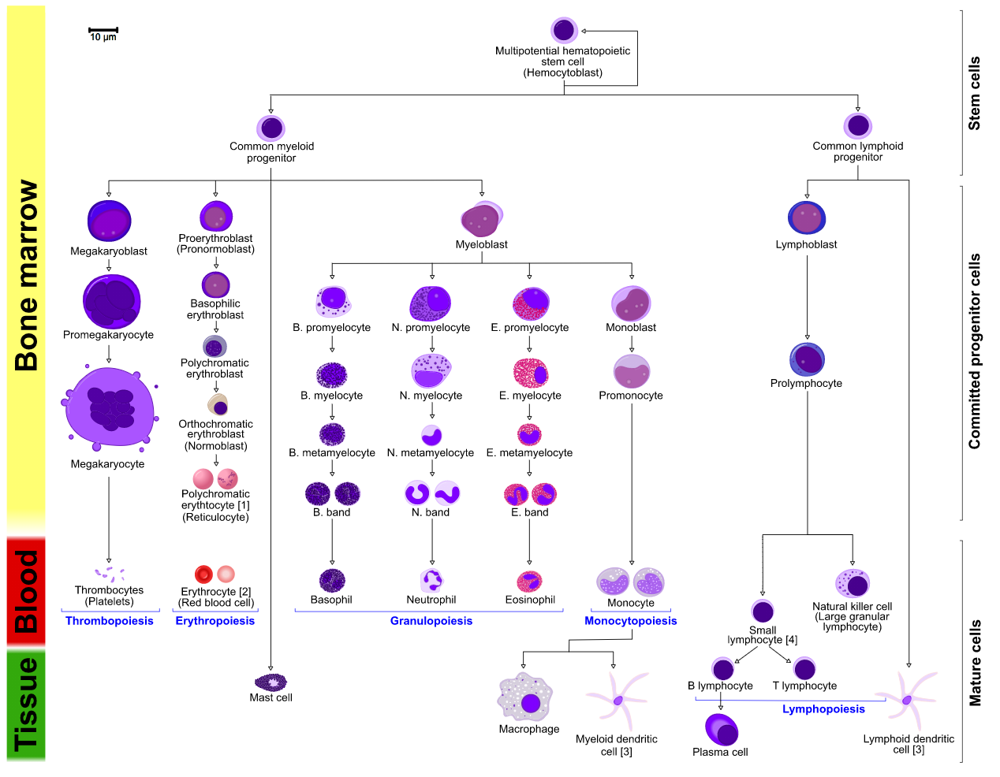
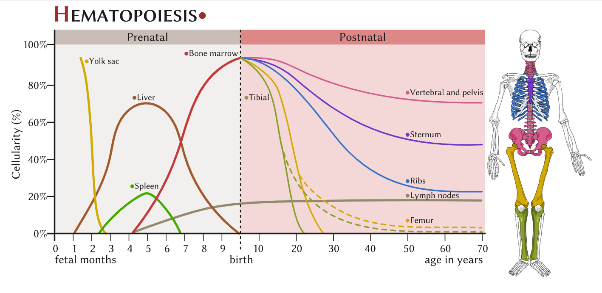
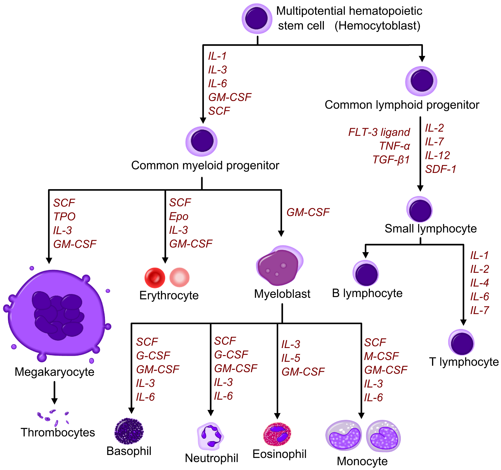

```{r setup, include=FALSE}
knitr::opts_chunk$set(echo = TRUE)
```

## Cell types

All blood cells are divided into three lineage:\
- **Red blood cells**, also called erythrocytes, are the oxygen-carrying
cells. Erythrocytes are functional and are released into the blood. The
number of reticulocytes, imature red blood cells, gives an estimate of
the rate of erythropoiesis. - **Lymphocytes** are the cornerstone of the
adaptive immune system. They are derived from common lymphoid
progenitors. The lymphoid lineage is composed of T-cells, B-cells and
natural killer cells. This is lymphopoiesis. - **Cells of the myeloid
lineage**, which include granulocytes, megakaryocytes and macrophages,
are derived from common myeloid progenitors, and are involved in such
diverse roles as innate immunity and blood clotting. This is
myelopoiesis.


## Terminology

Between 1948 and 1950, the Committe for Clarification of the
Nomenclature of Cells and Disease of the Blood and Blood-forming Organs
issued reports on the nomenclature of blood cells. An overview of the
terminology is shown below, from earliest to final stages of
development:  

- [root]blast  
- pro[root]cyte  
- [root]cyte  
- meta[root]cyte  
- mature cell name  


|**Committe**|**lympho**|**rubri**|**granulo or myelo**|**mono**|**megakaryo**|
|:--|:--|:--|:--|:--|:--|
|lineage|lymphoid|myeloid|myeloid|myeloid|myeloid|
|**CFU**|CFU-L|CFU-GEMM <br> CFU-E|CFU-GEMM <br> CFU-GM <br> CFU-G|CFU-GEMM <br> CFU-MEG|
|**Process**|lyphocytopoiesis|erythropoiesis|granulocytopoiesis|monocytopoiesis|thrombocytopoiesis|
|**[root]cyte**|lympoblast|proerythroblast|myeloblast|monoblast|megakaryoblast|
|**pro[root]cyte**|prolympocyte|polychromatophilic erythrocyte|promyelocyte|promonocyte|promegakaryocyte|
|**[root]cyte**|-|normoblast|Eosino/neutro/basophilic myelocyte|-|megakaryocyte|
|**meta[root]cyte**|large lymphocyte|reticulocyte|Eosinophilic/neutrophilic/basophilic metamyelocyte <br> Eosinophilic/neutrophilic/basophilic band ecll|Early monocyte|-|
|**mature cell name**|small lymphocyte|Erythrocyte|granulocytes(Eosino/neutro/basophil)|monocyte|thrombocytes (platelets)|

Osteoclasts also arise from hemopoietic cells of the monocyte/neutrophil
lineage, specifically CFU-GM.

```{r}

```


## Location

In developing embryos, blood formation occurs in aggregates of blood
cells in the yolk sac, called blood island. As development progresses,
blood formation occurs in the spleen, liver and lymph nodes. When bone
marrow develops, it eventually assumes the maturation, activation, and
some proliferation of lymphoid cells in the spleen, thymus, and lymph
nodes. In children, haematopoiesis occurs in the marrow of the long
bones such as the femur and tibia. In adults, it occurs mainly in the
pelvis, cranium, vertebrae, and sternum.

```{r}

```

## Growth factors
Red and white blood cell production is regulated with great precision in healthy humans, and the production of leukocytes is rapidly increased during infection. The proliferation and self-renewal of these cells depend on growth factors. One of the key players in self-renewal and development of haematopoietic cells is stem cell factor (SCF),[22] which binds to the c-kit receptor on the HSC. Absence of SCF is lethal.

```{r}

```


[Wikipadia](https://en.wikipedia.org/wiki/Haematopoiesis)
